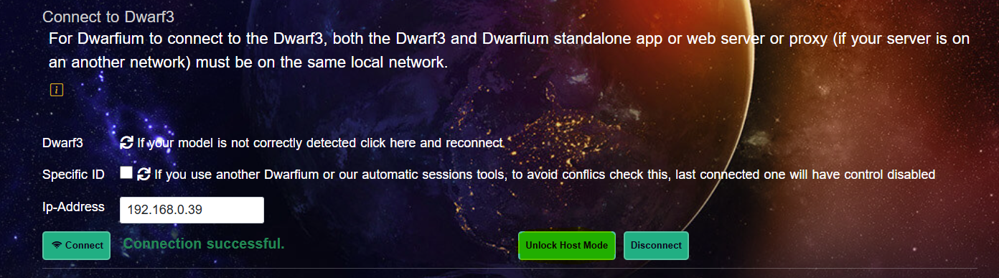

# Dwarfium


[](https://discord.gg/5vFWbsXDfv)


[English](README.md) | **日本語**

このアプリケーションは、DWARF 望遠鏡と Stellarium を [DWARF API](https://hj433clxpv.feishu.cn/docx/MiRidJmKOobM2SxZRVGcPCVknQg) および Stellarium リモートコントロールプラグインを通じて連携します。DWARF II と Stellarium を接続すると、Stellarium 上で天体を選択し、DWARF II にその天体への指向を指示できます。

ドキュメントは[こちら](https://tinyurl.com/Dwarfium)をご覧ください。


## 機能

### DWARF セッションデータ

セッションデータの閲覧とダウンロードが可能です。


### DWARF カメラ

公式アプリと同様に望遠鏡を操作できます。


### アプリケーションの自動アップデート

デスクトップアプリケーションは Windows、macOS、Linux 向けに提供されています。


### macOS サポート

macOS のサポートは限定的です。専用の Mac 環境がないため、十分なサポートを提供できていません。デスクトップアプリとして実行するにはコード署名が必要ですが、現時点では対応できていません。

[リリースページ](https://github.com/stevejcl/dwarfium/releases)で提供されている Web パッケージをご利用ください。

Mac ARM ユーザー向け:
アプリケーションがインストールできず、ゴミ箱に移動するよう求められる場合は、以下のコマンドを実行してください:

```bash
xattr -d com.apple.quarantine /Applications/Dwarfium.app
```

## 開発者向けセットアップ

コードを探索したりプロジェクトに貢献したい方は、以下の手順に従ってください:

このアプリは Next.js、TypeScript、Bootstrap CSS で構築されています。コードのリンティングとフォーマットには ESLint と Prettier を使用しています。

1. リポジトリをクローンします。

2. 必要なライブラリをインストールします。

```bash
npm install
```

3. 開発サーバーを起動します。

```bash
npm run dev:windows
または
npm run dev:linux
```

4. 本番用ビルドを作成します。

```bash
npm run build:api
```

以下のコマンドで起動します:

```bash
npm run start:windows
または
npm run start:linux
```

5. お使いの OS 向けにデスクトップアプリをビルドします。

デスクトップアプリのビルドには [Rust](https://www.rust-lang.org/learn/get-started) のインストールが必要です。

```bash
npm run tauri build
```

## 一般ユーザー向けセットアップ

サイトをお使いのマシンで動かしたいだけの方は、以下の手順に従ってください:

1. 希望する[リリース](https://github.com/stevejcl/dwarfium/releases)をダウンロードします。

2. Web ブラウザ版の場合:

   2.1. Windows 版 (Dwarfium-Win) と Linux 版の 2 種類があります。

   2.2. ファイルを解凍します。`Dwarfium` ディレクトリが作成されます。この Web サイトは静的 HTML サイト（HTML、JavaScript、CSS）なので、ブラウザと Web サーバーが動作する任意の OS で使用できます。

   2.3. `Dwarfium` ディレクトリ内に Python の Web サーバーと必要なツールを起動するスクリプトがあります。

   Linux の場合

   ```bash
   cd Dwarfium
   ./launch-server&tools
   ```

   Windows の場合

   ```cmd
   cd Dwarfium
   ./launch-server&tools.bat
   ```

   2.4. ブラウザでサイトにアクセスします。スクリプトを使用している場合は [localhost:8000](http://localhost:8000/) にアクセスしてください。

### ⚠️ DWARF を同時に制御できるアプリケーションは 1 つだけです（スレーブモード）

以下のメッセージが表示された場合、


**Dwarflab モバイルアプリ**がまだ接続されており、DWARF を制御している可能性があります。

---

#### 🛠 対処方法:

1. **Dwarflab** モバイルアプリを開きます。
2. ホームページで以下のチェックを外します:
   > **Set Current Device as Host**（現在のデバイスをホストに設定）
<p align="center">
  
  
  
</p>

3. 次のいずれかを行います:
   - モバイルアプリを完全に閉じる
   - スマートフォンの Wi-Fi をオフにする
   - DWARF デバイスを再起動する

約 **1 分後**、**Dwarfium** から DWARF にコマンドを送信できるようになります。

---

**最後に、Dwarflab 公式アプリに制御を戻したい場合:**

1. Dwarfium の Setup ページに移動します。

2. **Connect To** セクションで **Unlock Host Mode** をクリックし、**Disconnect** をクリックします。



## Dwarfium プロキシ設定

Dwarfium は内部的にプロキシプログラムを使用して、DWARF やその他のサービス（気象データ、小惑星データなど）と通信しています。

現在、プロキシへのアクセスを提供し、より多くのユースケースに対応しています。

例えば、美しい空のある地域に住んでいる友人がいるとします。

DWARF を友人の家に 1 週間以上設置し、自宅に戻ってからリモートで DWARF を制御できます。

その方法は？

Dwarfium は Web サーバーとプロキシの 2 つのコンポーネントに分けてインストールできます。プロキシは DWARF の近くに設置する必要があります。

リリースページに DwarfiumServer-Win.zip と Dwarfium-Win.zip があります。Linux 版は近日公開予定です。

異なるネットワークに別々にインストールできます。

   1.1. ファイルを解凍します。`DwarfiumServer` と `DwarfiumProxy` ディレクトリが作成されます。

   1.2. `DwarfiumServer` ディレクトリ内に Python の Web サーバーを起動するスクリプトがあります。

   ```cmd
   cd Dwarfium
   ./launch-server.bat
   ```

   1.3. `DwarfiumProxy` ディレクトリ内にプロキシと D3 ビデオストリーム用ツールを起動するスクリプトがあります。

   ```cmd
   cd DwarfiumProxy
   ./launch-tools.bat
   ```

サーバーには HTTPS の使用を推奨します。そのため Dwarfium 証明書が必要です。DwarfiumProxy はあなた個人のプロキシなので、証明書もあなた専用です。

証明書の作成は簡単です。提供されている createSSLcert.exe ツールを実行します。プロキシがある場所で一度実行すると、証明書が作成されコンピュータにインストールされます。

2 つのファイル（CADwarfiumCert.pem と CADwarfiumKey.pem）をサーバーのインストールディレクトリにコピーする必要があります。

同じ createSSLcert.exe ツールを使用して、サーバー用の証明書を作成します。
その後、HTTPS で Web サーバーにアクセスできます。

# `CADwarfiumCert.pem` 証明書のインストール方法

別のマシンからサーバーにアクセスする必要がある場合（例: 別の場所やモバイルデバイスから）、安全な接続を確保するために `CADwarfiumCert.pem` 証明書をインストールする必要があります。以下の手順に従って、お使いのシステムのルート証明書ストアに証明書を追加してください。

## Windows の場合:

1. **証明書マネージャーを開く:**
   - `Win + S`（Windows キー + S）を押して検索バーを開きます。
   - `cert` と入力し、検索結果から **「ユーザー証明書の管理」** を選択します。**証明書マネージャー**が開きます。

2. **証明書をインポートする:**
   - 証明書マネージャーで **信頼されたルート証明機関** フォルダを展開します。
   - このセクションの **証明書** フォルダを右クリックし、**すべてのタスク > インポート** を選択します。
   - 証明書インポートウィザードが表示されます。**次へ** をクリックします。

3. **証明書ファイルを選択する:**
   - **参照** をクリックし、`CADwarfiumCert.pem` 証明書ファイルの保存場所に移動して選択し、**開く** をクリックします。
   - **次へ** をクリックします。

4. **証明書ストアを選択する:**
   - **証明書をすべて次のストアに配置する** オプションが選択されていることを確認します。
   - リストから **信頼されたルート証明機関** を選択します。
   - **次へ** をクリックし、**完了** をクリックします。

5. **インストールを確認する:**
   - 証明書をインストールするかどうかのメッセージが表示されます。**はい** をクリックして確認します。
   - 証明書が正常にインポートされたことを確認する最終メッセージが表示されます。**OK** をクリックします。

## macOS の場合:

1. **キーチェーンアクセスを開く:**
   - **Spotlight**（`Cmd + Space`）を開き、**キーチェーンアクセス** と入力して **Enter** を押します。

2. **証明書をインポートする:**
   - **キーチェーンアクセス** ウィンドウで、左サイドバーの **システム** をクリックします。
   - `CADwarfiumCert.pem` 証明書ファイルをキーチェーンアクセスウィンドウにドラッグするか、**ファイル > 項目を読み込む** で証明書ファイルを選択します。

3. **証明書を信頼する:**
   - インポート後、**システム** キーチェーンのリストで証明書を見つけます。
   - 証明書をダブルクリックしてプロパティを開きます。
   - **信頼** セクションを展開し、ドロップダウンメニューから **常に信頼** を選択します。

4. **キーチェーンアクセスを閉じる:**
   - キーチェーンアクセスを閉じます。証明書が信頼され、使用可能な状態になります。

## Linux（Ubuntu）の場合:

1. **証明書をインストールする:**
   - ターミナルを開き、以下のコマンドを実行します:

     ```bash
     sudo cp CADwarfiumCert.pem /usr/local/share/ca-certificates/
     ```

2. **証明書ストアを更新する:**
   - システムの信頼された証明書を更新するには、以下を実行します:

     ```bash
     sudo update-ca-certificates
     ```

3. **インストールを確認する:**
   - 証明書が正しくインストールされたことを確認するには、以下を実行します:

     ```bash
     sudo ls /etc/ssl/certs | grep CADwarfiumCert
     ```

4. **ブラウザ/アプリケーションを再起動する:**
   - 証明書を追加した後、サーバーへのアクセスが必要なブラウザやアプリケーションを再起動して変更を反映させます。

## モバイルデバイス（Android/iOS）の場合:

1. **証明書を転送する:**
   - まず、`CADwarfiumCert.pem` 証明書をモバイルデバイスに送信します。メール、クラウドストレージ、または直接転送で行えます。

2. **証明書をインストールする:**
   - **Android** の場合: **設定 > セキュリティ > ストレージからインストール** に移動し、証明書を選択します。
   - **iOS** の場合: 証明書を自分宛にメールし、タップしてインストールを開始します。信頼された証明書に追加するよう求められます。

3. **証明書を確認する:**
   - インストール後、モバイルデバイスはサーバーへの安全な接続のために証明書を信頼します。

## なぜこの設定が必要なのか？

この証明書は、接続先のサーバーが正当で信頼できるものであることを確認するために使用されます。証明書をマシンの信頼されたストアに追加しないと、セキュリティの警告が表示されたり、安全に接続できない場合があります。

手順で問題が発生した場合は、お気軽にお問い合わせください。


# 設定

## プロキシとサーバーを異なるネットワークに配置する場合

Web サーバーとプロキシが異なる場所にある場合、互いに通信する必要があります。

最も簡単な方法は Tailscale などの VPN を使用することです。Tailscale は様々なシステム（PC、Linux、Android、iPhone）にインストールでき、インターネット接続がある限り互いに通信できます。

VPN を使用しなくてもリモートのサーバーにアクセスできますが、サーバー側のルーターでポート 8000 を転送し、プロキシ側ではポート 8860 と 9443 を転送する必要があります。

サーバーの内部ローカルネットワーク IP（https://Server_IP:8000）を使用して Dwarfium を開きます。

Setup ページに移動します。


Proxy IP フィールドに DWARF プロキシのローカル IP を設定する必要があります。

VPN をインストールしていない場合は、Proxy IP フィールドにパブリック IP を使用し、Proxy Local IP フィールドに内部 IP を使用します。
Save Proxy IP をクリックします。

接続情報が緑色に変わります。

プロキシ上の Direct Bluetooth detection（DWARF の近く）を使用して DWARF に接続します。

成功後、Connect Session で DWARF の IP に接続します。

## 技術的な詳細

Stellarium リモートコントロールプラグインは、Web ブラウザから Stellarium デスクトップアプリにアクセスするための Web サーバーを起動します。Stellarium で天体を選択すると、`http://<localhost または IP>:<port>/api/main/status` を通じてその天体の情報を取得できます。

このアプリは `/api/main/status` に接続し、返されたデータを解析して天体の名前、赤経、赤緯を取得します。そして、DWARF API を通じて赤経、赤緯、緯度、経度のデータとともに指向コマンドを DWARF に送信します。

デスクトップアプリは Web サービスをウィンドウ環境でラップしています。Rust が Web サービスを提供し、ページを配信します。
