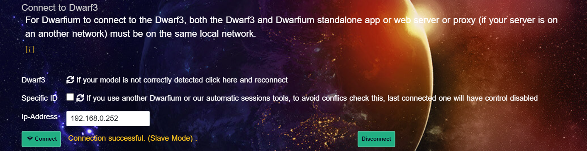
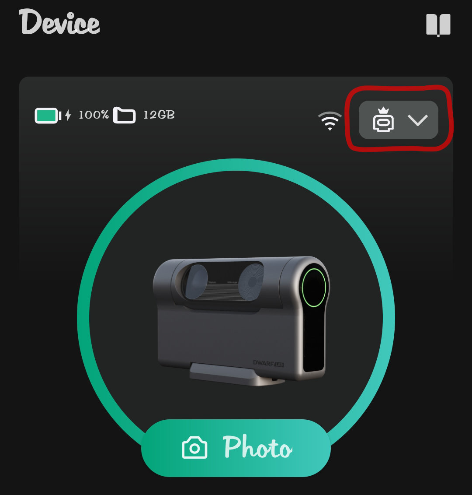
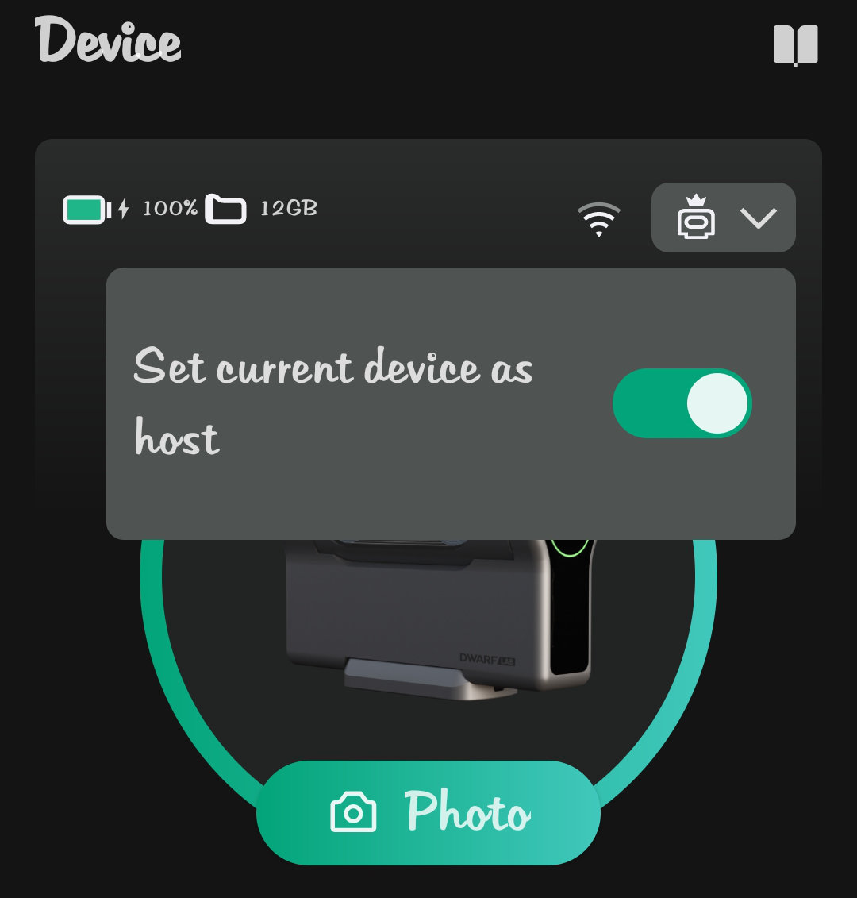
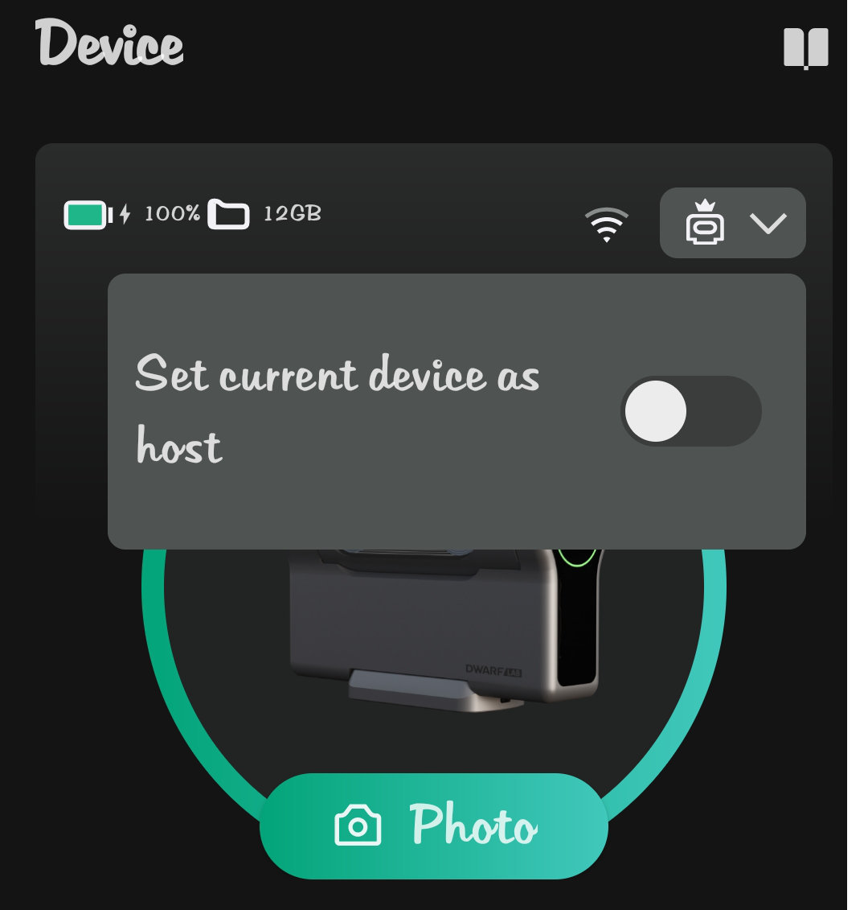
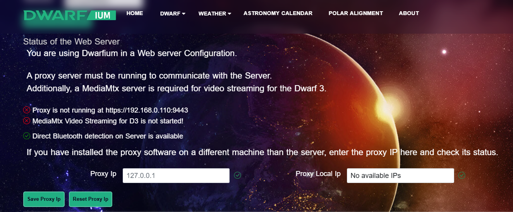

# Dwarfium


[](https://discord.gg/5vFWbsXDfv)


This application connects to the DWARF telescope and integrates with Stellarium via the [DWARF API](https://hj433clxpv.feishu.cn/docx/MiRidJmKOobM2SxZRVGcPCVknQg) and the Stellarium remote control plugin. Once DWARF II and Stellarium are connected, you can select an object in Stellarium and command DWARF II to point to that object.

You can find the documentation [here](https://tinyurl.com/Dwarfium).


## Features

### DWARF Session Data

You can access and download your session data for inspection.


### DWARF Camera

You can control the telescope just as you would with the official app.


### Automated Updates for Application Versions

The desktop application is available for Windows, macOS, and Linux.


### macOS Support

Support for macOS is limited as we do not have a Mac available for dedicated support. Running this tool as a desktop application requires signing, which is currently not feasible for us.

You can still use Dwarfium with the provided web package available [here](https://github.com/stevejcl/dwarfium/releases).

For Mac ARM users:
If you encounter an issue where the application can't be installed and should be moved to the trash, use the following command:

```bash
xattr -d com.apple.quarantine /Applications/Dwarfium.app
```

## Setup for Coders

If you're interested in exploring the code or contributing to the project, follow these steps:

This app is built with Next.js, TypeScript, and Bootstrap CSS. It uses ESLint and Prettier for linting and formatting the code.

1. Clone the repository.

2. Install the necessary libraries.

```bash
npm install
```

3. Start the server.

```bash
npm run dev:windows
or
npm run dev:linux
```

4. Create a production-ready build.

```bash
npm run build:api
```
   Start it with :

```bash
npm run start:windows
or
npm run start:linux
```

5. Build the desktop app for your operating system.

To build the desktop app, you need to install [Rust](https://www.rust-lang.org/learn/get-started).

```bash
npm run tauri build
```

## Setup for Non-Coders

If you just want to get the site up and running on your machine, follow these steps:

1. Download the desired [release](https://github.com/stevejcl/dwarfium/releases).

2. For the web browser version:

   2.1. There are two versions, one for Windows (Dwarfium-Win) and one for Linux

   2.2. Unzip the file. A `Dwarfium` directory will be created. The website is a static HTML site (HTML, JavaScript, and CSS), so it should work on any OS that can run a browser and a web server.

   2.3. There is a script inside the `Dwarfium` directory that launch a Python's web server and necessary tools.

   On Linux

   ```bash
   cd Dwarfium
   ./launch-server&tools
   ```

   On Windows

   ```cmd
   cd Dwarfium
   ./launch-server&tools.bat
   ```

   2.4. Visit the site in a browser. If you're using the script, visit [localhost:8000](http://localhost:8000/).

### ⚠️ Only one application can control the Dwarf at a time

If you see this message, 



it's likely because the **Dwarflab mobile app** is still connected.

---

#### 🛠 What to do:

1. Open the **Dwarflab** mobile app.
2. On the home page, **uncheck**:
   > **Set Current Device as Host**
3. Then choose one of the following:
   - Close the mobile app completely  
   - Turn off Wi-Fi on your phone  
   - Restart the Dwarf device

<p align="center">
  
  
  
</p>

---

After about **one minute**, **Dwarfium** should be able to send commands to the Dwarf.

## Dwarfium Proxy Configuration

Dwarfium used internally a proxy programm to communicate with the dwarf and other services (Meteo data, Asteroids, etc).

Now we provided access to the proxy to permits more use cases.

Imagine you have a friend who lives in a region with a beautiful sky and not you!

Now for a week or more install the Dwarf in his house, and now back to home, you can remote control your dwarf.

How to do that?

Dwarfium can be installed in two components a web server and the proxy, the proxy must be installed near the Dwarf to control it.

in the release page you will find: DwarfiumServer-Win.zip and Dwarfium-Win.zip , Linux version will come soon.

You can install them separately in different networks

   1.1. Unzip the files. `DwarfiumServer` and `DwarfiumProxy` directories will be created. 

   1.2. There is a script inside the `DwarfiumServer` directory that launch a Python's web server.

   ```cmd
   cd Dwarfium
   ./launch-server.bat
   ```

   1.3. There is a script inside the `DwarfiumProxy` directory that launch the Proxy and the tools for D3 video streams.

   ```cmd
   cd DwarfiumProxy
   ./launch-tools.bat
   ```

It's better to use https for the server, so you need to use a Dwarfium Certificate. As the DwarfiumProxy is your personnal proxy, the certificate is yours only.

The certificate creation is easy, a tool createSSLcert.exe is provided, run it once where your proxy is, it will create and install the certificate on your computer.

You need to copy the two files (CADwarfiumCert.pem and CADwarfiumKey.pem) on the server Installation dir.

Use the same tools createSSLcert.exe, this will create the certificate for the server.
Then you can access to the web server in https.

# How to Add `CADwarfiumCert.pem` Certificate for Server Access

If you need to access a server from another machine (e.g., from a different location, or a mobile device), you must install the `CADwarfiumCert.pem` certificate on that machine to ensure a secure connection. Follow the steps below to add this certificate to the root certificate store on your system.

## For Windows:

1. **Open the Certificate Manager:**
   - Press `Win + S` (Windows key + S) to open the search bar.
   - Type `cert` and select **"Manage user certificates"** from the search results. This will open the **Certificate Manager**.

2. **Import the Certificate:**
   - In the Certificate Manager, expand the **Trusted Root Certification Authorities** folder.
   - Right-click on the **Certificates** folder under this section and select **All Tasks > Import**.
   - The Certificate Import Wizard will appear. Click **Next**.

3. **Select the Certificate File:**
   - Click **Browse**, navigate to the location where you saved the `CADwarfiumCert.pem` certificate file, select it, and click **Open**.
   - Click **Next**.

4. **Choose the Certificate Store:**
   - Make sure the option **Place all certificates in the following store** is selected.
   - Choose **Trusted Root Certification Authorities** from the list.
   - Click **Next** and then **Finish**.

5. **Confirm the Installation:**
   - A message will appear asking if you want to install the certificate. Click **Yes** to confirm.
   - A final message will appear confirming the successful import of the certificate. Click **OK**.

## For macOS:

1. **Open Keychain Access:**
   - Open **Spotlight** (press `Cmd + Space`) and type **Keychain Access**, then press **Enter**.
   
2. **Import the Certificate:**
   - In the **Keychain Access** window, click on **System** in the left sidebar.
   - Drag the `CADwarfiumCert.pem` certificate file into the Keychain Access window, or go to **File > Import Items** and select the certificate file.

3. **Trust the Certificate:**
   - After importing, locate the certificate in the list under **System** keychain.
   - Double-click on the certificate to open its properties.
   - Expand the **Trust** section and select **Always Trust** from the dropdown menu.

4. **Close Keychain Access:**
   - Close the Keychain Access application. The certificate is now trusted and ready for use.

## For Linux (Ubuntu):

1. **Install the Certificate:**
   - Open a terminal and run the following command to install the certificate:
   
     ```bash
     sudo cp CADwarfiumCert.pem /usr/local/share/ca-certificates/
     ```

2. **Update the Certificate Store:**
   - To update the system’s trusted certificates, run:
   
     ```bash
     sudo update-ca-certificates
     ```

3. **Verify the Installation:**
   - To check that the certificate is installed correctly, you can run:
   
     ```bash
     sudo ls /etc/ssl/certs | grep CADwarfiumCert
     ```

4. **Restart Your Browser/Application:**
   - After adding the certificate, restart any browser or application that needs access to the server to apply the changes.

## For Mobile Devices (Android/iOS):

1. **Transfer the Certificate:**
   - First, send the `CADwarfiumCert.pem` certificate to your mobile device. You can do this via email, cloud storage, or direct transfer.
   
2. **Install the Certificate:**
   - On **Android**, go to **Settings > Security > Install from storage** and select the certificate.
   - On **iOS**, email the certificate to yourself and tap on it to begin the installation process. You will be prompted to add it to your trusted certificates.

3. **Verify the Certificate:**
   - After installation, the mobile device will trust the certificate for secure connections to the server.

## Why Is This Necessary?

The certificate is used to ensure that the server you are connecting to is legitimate and trustworthy. Without adding the certificate to your machine's trusted store, you may face security warnings or be unable to connect securely.

If you have any questions or run into issues during the process, feel free to ask!


# Configuration

## Proxy and Server in a different network

As the web server is in a different place as the proxy, they need to communicate together.

The easiest way is to use a VPN like Tailscale: you can install Taiscale on different system (PC, Linux, Android, IPhone) and as long as an internet connection is available, they can speak together.

You do not need to use a VPN, you can access to the server even it's on remote, but you need to forward the port 8000 on the rooter where the server is : 8000 and for the proxy it is 8860 and 9443.

You use the internal local network Ip of the server (https://Server_IP:8000) to open Dwarfium.

Go to the Setup page.



You have to set the Dwarf Proxy Local IP in the Proxy IP field.

If you have not install a VPN, use the publi IP in the Proxy IP field and use the internal Ip for the Proxy Local Ip field.
Click on Save Proxy IP

The Connexion Info must now be green now.

Use the Direct Bluetooth detection on Proxy (near the Dwarf) to connect to the Dwarf

After success, connect to the Dwarf IP in the Connect Session

## Technical Details

The Stellarium remote control plugin starts a web server that allows access to the Stellarium desktop app through a web browser. When you select an object in Stellarium, you can retrieve information about that object through `http://<localhost or IP>:<port>/api/main/status`.

This app connects to `/api/main/status` and parses the returned data to get the object's name, right ascension, and declination. It then sends a go-to command to the DWARF with the right ascension, declination, latitude, and longitude data via the DWARF API.

The desktop app wraps the web service in a windowed environment. Rust provides the web service and serves the pages.
